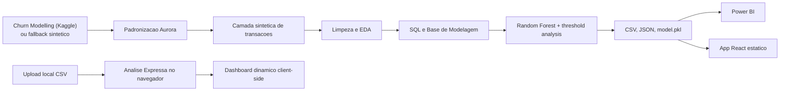

# Aurora Finance Intelligence

**Dados que antecipam riscos, revelam padroes e apoiam decisoes financeiras mais humanas.**

Aurora Finance Intelligence e uma solucao de dados ponta a ponta para analise financeira, risco e previsao de churn. O projeto combina pipeline em Python, SQL, Power BI, Machine Learning e um frontend React estatico com cara de produto real.

Autoria: **Vitoria Freitas**

## O que e a Aurora

A Aurora foi pensada para um hackathon de dados, mas com mentalidade de produto:

- identifica sinais antecipados de churn
- organiza comportamento financeiro e consumo
- gera insumos para BI, storytelling e decisao
- roda localmente sem backend obrigatorio
- aceita base publica do Kaggle com fallback sintetico
- permite upload local de CSV para uma analise expressa no navegador

## Problema de negocio

Empresas financeiras muitas vezes percebem tarde demais que um cliente esta prestes a reduzir relacionamento ou sair. Quando esse risco fica obvio, a janela de retencao ja diminuiu.

A Aurora ajuda a agir antes, transformando sinais dispersos em fila de priorizacao para retencao.

## Dataset publico principal

O projeto foi adaptado para usar como base publica principal o dataset:

- `Churn Modelling`
- plataforma: `Kaggle`
- arquivo local esperado: `dados/raw/churn_modelling.csv`

O projeto **nao faz download automatico do Kaggle**, porque isso exigiria autenticacao.

## Como a base publica entra na solucao

Se `dados/raw/churn_modelling.csv` existir:

- a Aurora carrega o dataset publico
- usa `Exited` como target de churn
- padroniza os campos para o schema interno
- converte `EstimatedSalary` de salario anual para `renda_mensal`
- usa `Geography` como localizacao
- usa `Surname` como nome do cliente
- marca `origem_dado = public_kaggle_churn_modelling`

Se o arquivo nao existir:

- a Aurora usa o fallback sintetico
- marca `origem_dado = synthetic_fallback`
- `python -m src.pipeline` continua funcionando normalmente

## Por que ainda existem transacoes sinteticas

O dataset `Churn Modelling` nao possui historico transacional por categoria. Por isso a Aurora adiciona uma **camada sintetica de transacoes financeiras** para viabilizar:

- Python e estatistica exploratoria
- SQL na pratica
- Power BI
- Machine Learning
- storytelling executivo

Essa camada e reprodutivel e coerente com `renda_mensal`, `saldo_atual`, `perfil_risco`, `membro_ativo` e `churn_flag`.

No modo publico, as transacoes sinteticas sao geradas a partir de sinais de perfil e relacionamento, sem usar `Exited` para moldar o comportamento transacional. Isso reduz risco de data leakage na modelagem.

## Requisitos do hackathon atendidos

- `Python e estatistica exploratoria`: pipeline em `src/`, outputs em `dados/outputs/` e figuras em `reports/figuras/`
- `SQL na pratica`: `sql/schema.sql` e `sql/queries_analiticas.sql`
- `Power BI e storytelling`: `powerbi/README.md` e `docs/storytelling_powerbi.md`
- `Machine Learning`: treino, metricas, threshold analysis e feature importance
- `modelo em producao`: `modelo/model.pkl` e inferencia em `src/predict_churn.py`
- `documentacao para GitHub`: README e docs complementares
- `evidencias tecnicas`: CSVs, JSONs, notebooks, screenshots e modelo salvo

## Arquitetura



## Como executar o pipeline

```powershell
python -m venv .venv
.venv\Scripts\activate
pip install -r requirements.txt
python -m src.pipeline
```

Comando principal:

```powershell
python -m src.pipeline
```

## Como executar o frontend

```powershell
cd app
npm install
npm run dev
```

## Como gerar build

```powershell
cd app
npm run build
```

## Evidencia de execucao local

Os comandos abaixo foram validados localmente para demonstrar que o frontend roda sem backend e sem servicos pagos:

```powershell
cd app
npm install
# audited 183 packages
# found 0 vulnerabilities

npm run dev
# VITE v6.4.2 ready
# Local: http://localhost:5173/
```

## Preview do produto

A Aurora tambem entrega uma interface React estatica com visual de produto SaaS premium. Os prints abaixo foram gerados localmente a partir do app e servem como evidencia visual para GitHub e banca.

### Landing Page


### Dashboard Executivo


### Clientes em Risco


### ML Insights


### Analise Expressa


### Arquitetura e Power BI Guide

<p>
  
  
</p>

## Como usar o Upload de Planilha

No frontend, acesse a aba `Analise Expressa` ou clique em `Suba sua planilha` na Landing Page.

O recurso aceita CSV local com colunas no padrao Aurora ou nomes equivalentes do `Churn Modelling`. Exemplo disponivel em:

- `app/public/examples/exemplo_clientes_upload.csv`

Colunas recomendadas:

- `cliente_id`
- `idade`
- `genero`
- `estado`
- `renda_mensal`
- `saldo_atual`
- `score_credito`
- `produtos_ativos`
- `membro_ativo`
- `churn_flag`
- `prob_churn`
- `risco`

Tambem sao reconhecidas colunas do Kaggle, como `CustomerId`, `Age`, `Gender`, `Geography`, `EstimatedSalary`, `Balance`, `CreditScore`, `NumOfProducts`, `IsActiveMember` e `Exited`.

Privacidade: a planilha nao e enviada para servidor. Toda a leitura, normalizacao, score express, graficos e exportacao rodam localmente no navegador.

Importante: se o CSV nao tiver `prob_churn`, o frontend calcula um score heuristico demonstrativo. O modelo oficial da Aurora continua sendo o `RandomForestClassifier` treinado pelo pipeline Python.

## Como rodar a inferencia separadamente

Se o modelo ja tiver sido treinado:

```powershell
python -m src.predict_churn
```

Esse comando reaplica o `modelo/model.pkl` na base de modelagem atual e atualiza `dados/outputs/predicoes_churn.csv`.

## Outputs obrigatorios

O pipeline gera e preserva os artefatos principais:

- `dados/processed/clientes_limpo.csv`
- `dados/processed/transacoes_limpo.csv`
- `dados/processed/categorias_limpo.csv`
- `dados/processed/base_modelagem.csv`
- `dados/outputs/predicoes_churn.csv`
- `dados/outputs/metricas_modelo.json`
- `dados/outputs/feature_importance.csv`
- `dados/outputs/threshold_analysis.csv`
- `app/public/data/metrics.json`
- `app/public/data/predictions.json`
- `app/public/data/feature_importance.json`
- `app/public/data/summary.json`
- `app/public/data/threshold_analysis.json`

O projeto tambem preserva os nomes antigos de apoio:

- `dados/processed/clientes_tratados.csv`
- `dados/processed/transacoes_tratadas.csv`
- `dados/processed/categorias_tratadas.csv`
- `dados/processed/base_analitica_clientes.csv`

## Machine Learning e defesa de banca

O modelo principal e um `RandomForestClassifier` com `class_weight="balanced"`.

As metricas nao ficam fixas no README. Os valores atualizados de cada execucao ficam em:

- `dados/outputs/metricas_modelo.json`

Esse arquivo registra, entre outros:

- `accuracy`
- `precision`
- `recall`
- `f1_score`
- `roc_auc`
- `baseline_churn_rate`
- `threshold_used`

O projeto tambem compara thresholds em:

- `dados/outputs/threshold_analysis.csv`

Como defender o modelo:

- `precision` mostra a qualidade dos alertas
- `recall` mostra a capacidade de capturar clientes que poderiam sair
- `roc_auc` mostra a capacidade de ranquear risco
- em churn, falso negativo importa
- o MVP usa ranking de risco e priorizacao, nao decisao automatica

## Power BI

O guia pratico esta em:

- [powerbi/README.md](powerbi/README.md)
- [docs/storytelling_powerbi.md](docs/storytelling_powerbi.md)

O `.pbix` pode ficar local ou entrar no repositorio se o tamanho permitir. Os screenshots devem entrar em `powerbi/screenshots/` como evidencia.

O upload express do frontend e uma camada interativa complementar para demonstracao rapida. Ele nao substitui o Power BI oficial, que continua baseado nos CSVs e JSONs gerados pelo pipeline.

## Evidencias tecnicas

- `dados/outputs/metricas_modelo.json`
- `dados/outputs/predicoes_churn.csv`
- `dados/outputs/feature_importance.csv`
- `dados/outputs/threshold_analysis.csv`
- `dados/outputs/classification_report.json`
- `reports/figuras/`
- `reports/screenshots/app/`
- `sql/`
- `notebooks/`
- `app/public/data/`
- `modelo/model.pkl`
- `powerbi/screenshots/`

## Evolucao futura

- calibrar threshold com meta operacional real
- comparar outros modelos sem overengineering
- adicionar monitoramento de drift
- publicar um `.pbix` final quando o tamanho permitir
- evoluir upload XLSX no navegador caso o peso da dependencia seja aceitavel
- conectar a API apenas se houver necessidade real

## Documentacao complementar

- [docs/dataset_publico.md](docs/dataset_publico.md)
- [docs/dicionario_dados.md](docs/dicionario_dados.md)
- [docs/arquitetura_solucao.md](docs/arquitetura_solucao.md)
- [docs/storytelling_powerbi.md](docs/storytelling_powerbi.md)
- [docs/perguntas_banca.md](docs/perguntas_banca.md)
