# Aurora Finance Intelligence

**Dados que antecipam riscos, revelam padrões e apoiam decisões financeiras mais humanas.**

Aurora Finance Intelligence é uma solução de dados ponta a ponta para análise financeira, risco e previsão de churn. O projeto combina pipeline em Python, SQL, Power BI, Machine Learning, app React estático e uma camada de Análise Expressa para upload local de CSV no navegador.

Autoria: **Vitória Freitas**

## O Que É A Aurora

A Aurora foi pensada para um hackathon de dados, mas com mentalidade de produto:

- Identifica sinais antecipados de churn.
- Organiza comportamento financeiro, consumo e risco.
- Gera insumos para BI, storytelling e decisão executiva.
- Roda localmente sem backend obrigatório.
- Usa dataset público do Kaggle com fallback sintético.
- Permite upload local de CSV para uma análise expressa no navegador.

## Problema De Negócio

Empresas financeiras muitas vezes percebem tarde demais que um cliente está prestes a reduzir relacionamento ou sair. Quando esse risco fica óbvio, a janela de retenção já diminuiu.

A Aurora ajuda a agir antes, transformando sinais dispersos em uma fila de priorização para retenção, com explicabilidade suficiente para apoiar decisões humanas, não automatizar decisões finais.

## Diferenciais

- Dataset público `Churn Modelling` do Kaggle como base principal quando o CSV está disponível.
- Fallback sintético para manter o projeto reprodutível mesmo sem arquivo Kaggle local.
- Camada sintética de transações para viabilizar EDA, SQL, Power BI e storytelling.
- Correção de risco de data leakage: as transações sintéticas não usam `Exited` para moldar comportamento transacional.
- Modelo oficial em produção local com `RandomForestClassifier`, `model.pkl` e inferência separada.
- Power BI preparado com `.pbix`, tema visual, medidas DAX, guia de montagem e screenshots reais.
- App React premium, estático, responsivo e pronto para deploy gratuito.
- Análise Expressa com upload local de CSV, sem backend e sem envio de arquivo para servidor.
- Arquitetura premium free, AWS-ready e sem serviço cloud obrigatório.

## Dataset Público Principal

O projeto foi adaptado para usar como base pública principal o dataset:

- `Churn Modelling`
- Plataforma: `Kaggle`
- Arquivo local esperado: `dados/raw/churn_modelling.csv`

O projeto **não faz download automático do Kaggle**, porque isso exigiria autenticação.

## Como A Base Pública Entra Na Solução

Se `dados/raw/churn_modelling.csv` existir:

- A Aurora carrega o dataset público.
- Usa `Exited` como target de churn.
- Preserva o identificador original em `customer_id_original`.
- Padroniza os campos para o schema interno.
- Converte `EstimatedSalary` de salário anual estimado para `renda_mensal`.
- Usa `Geography` como localização.
- Usa `Surname` como nome/sobrenome do cliente.
- Marca `origem_dado = public_kaggle_churn_modelling`.

Se o arquivo não existir:

- A Aurora usa o fallback sintético.
- Marca `origem_dado = synthetic_fallback`.
- `python -m src.pipeline` continua funcionando normalmente.

## Por Que Ainda Existem Transações Sintéticas

O dataset `Churn Modelling` não possui histórico transacional por categoria. Por isso, a Aurora adiciona uma **camada sintética de transações financeiras** para viabilizar:

- Python e estatística exploratória.
- SQL na prática.
- Power BI.
- Machine Learning.
- Storytelling executivo.

Essa camada é reprodutível e coerente com `renda_mensal`, `saldo_atual`, `perfil_risco`, `membro_ativo` e `churn_flag`.

No modo público, as transações sintéticas são geradas a partir de sinais de perfil e relacionamento, sem usar `Exited` para moldar o comportamento transacional. Isso reduz risco de data leakage na modelagem.

## Requisitos Do Hackathon Atendidos

- `Python e estatística exploratória`: pipeline em `src/`, outputs em `dados/outputs/` e figuras em `reports/figuras/`.
- `SQL na prática`: `sql/schema.sql` e `sql/queries_analiticas.sql`.
- `Power BI e storytelling`: `powerbi/README.md`, `docs/storytelling_powerbi.md`, `.pbix` e screenshots reais.
- `Machine Learning`: treino, métricas, threshold analysis e feature importance.
- `Modelo em produção`: `modelo/model.pkl` e inferência em `src/predict_churn.py`.
- `Documentação para GitHub`: README e docs complementares.
- `Evidências técnicas`: CSVs, JSONs, notebooks, screenshots, Power BI e modelo salvo.

## Arquitetura

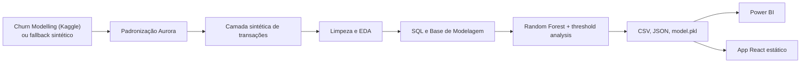

A versão premium também possui uma rota opcional no frontend:

```text
Upload local CSV -> Análise Expressa no navegador -> Dashboard dinâmico client-side
```

## Notebooks Do Processo

Os notebooks são a evidência didática do processo pedido no hackathon. Eles mostram o caminho passo a passo, desde a leitura dos dados até a defesa dos resultados, antes da camada visual do app React.

Execute primeiro:

```powershell
python -m src.pipeline
```

Depois abra os notebooks em `notebooks/`:

| Notebook | O que demonstra |
|---|---|
| `01_carregamento_e_limpeza.ipynb` | Carregamento do `Churn Modelling`, colunas originais, diagnóstico de nulos/duplicatas e padronização para o schema Aurora. |
| `02_analise_exploratoria.ipynb` | Estatísticas descritivas, taxa de churn, distribuições, análise por estado, perfil de risco, categorias e evolução mensal. |
| `03_sql_insights.ipynb` | SQLite em memória com consultas de validação, volume por estado, top categorias, saldo mensal, churn por perfil e clientes prioritários. |
| `04_modelo_churn.ipynb` | Comparação didática entre Logistic Regression, Decision Tree e Random Forest, com métricas, matriz de confusão, threshold e feature importance. |
| `05_storytelling_resultados.ipynb` | Síntese dos outputs finais, conexão com Power BI e roteiro curto de apresentação: problema -> dados -> análise -> modelo -> dashboard -> impacto. |

A aplicação React é um bônus de produto e apresentação. A entrega técnica principal continua documentada nos notebooks, SQL, Power BI e modelo em produção local.

## Como Executar O Pipeline

```powershell
python -m venv .venv
.venv\Scripts\activate
pip install -r requirements.txt
python -m src.pipeline
```

Comando principal:

```powershell
python -m src.pipeline
```

## Como Executar O Frontend

```powershell
cd app
npm install
npm run dev
```

Acesse:

- `http://localhost:5173/`

## Como Testar A Análise Expressa

```powershell
cd app
npm run dev
```

Abra no navegador:

- `http://localhost:5173/#/upload-planilha`

Use o arquivo de exemplo:

- `app/public/examples/exemplo_clientes_upload.csv`

## Como Gerar Build

```powershell
cd app
npm run build
```

## Evidência De Execução Local

Os comandos abaixo foram validados localmente para demonstrar que o frontend roda sem backend e sem serviços pagos:

```powershell
cd app
npm install
# audited 183 packages
# found 0 vulnerabilities

npm run dev
# VITE v6.4.2 ready
# Local: http://localhost:5173/
```

## Preview Do Produto

A Aurora também entrega uma interface React estática com visual de produto SaaS premium. Os prints abaixo foram gerados localmente a partir do app e servem como evidência visual para GitHub e banca.

### Landing Page

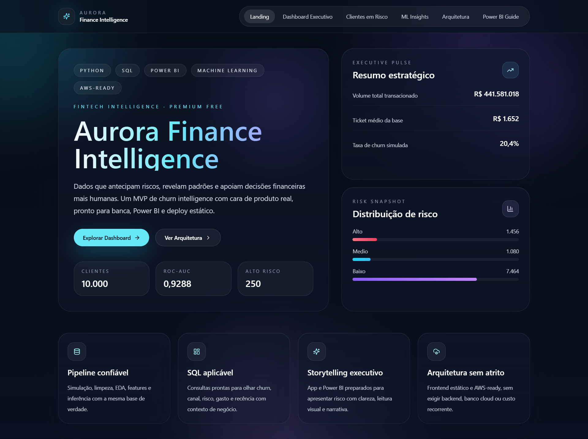

### Dashboard Executivo

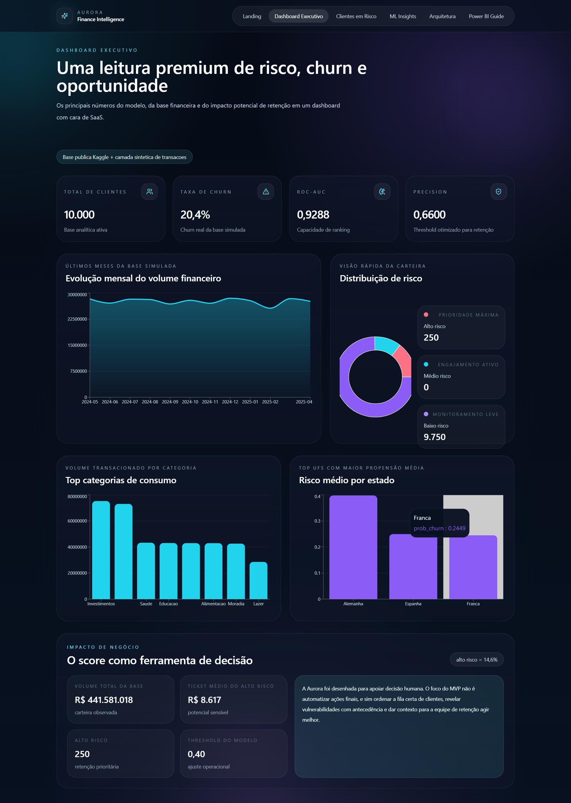

### Clientes Em Risco

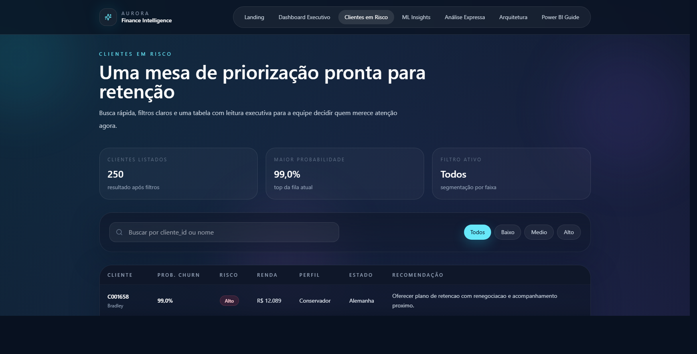

### ML Insights

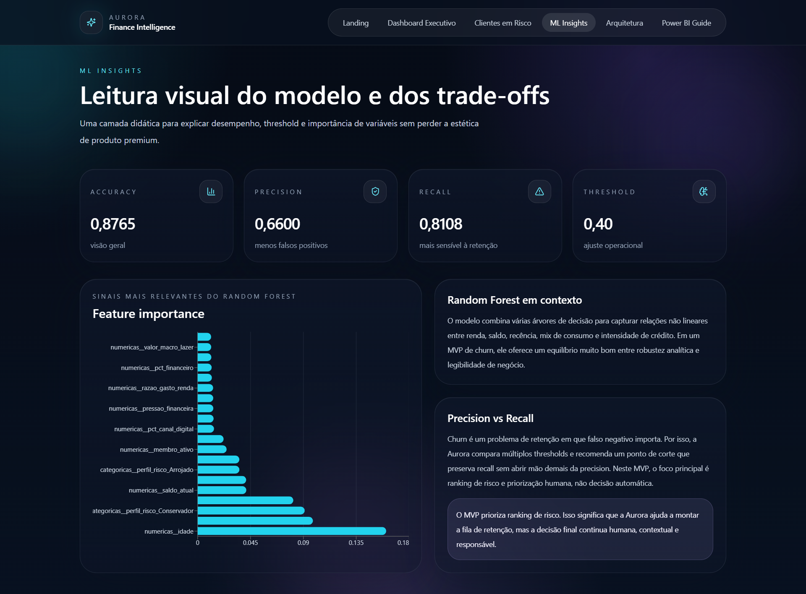

### Análise Expressa

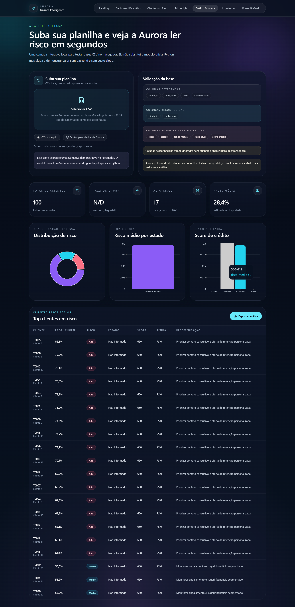

### Arquitetura E Power BI Guide

<p>
  
  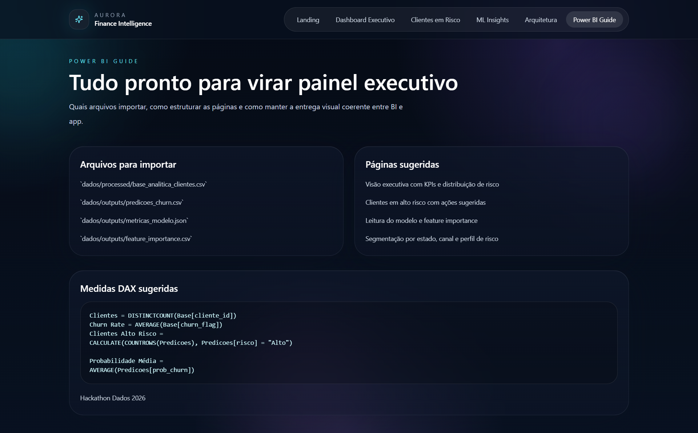
</p>

## Análise Expressa: Suba Sua Planilha

O frontend possui uma aba chamada `Análise Expressa`, criada para demonstrar valor de produto sem backend, sem banco e sem serviços pagos.

O usuário pode subir um CSV local de clientes com colunas no padrão Aurora ou com nomes equivalentes ao `Churn Modelling`. A planilha é processada localmente no navegador: nenhum arquivo é enviado para servidor.

A análise gera automaticamente:

- KPIs de clientes, churn observado, risco alto e probabilidade média.
- Distribuição de risco.
- Risco médio por estado.
- Gráfico por faixa de score de crédito.
- Tabela de clientes prioritários para retenção.
- Exportação da análise com `cliente_id`, `prob_churn`, `risco` e `recomendacao`.

Se o CSV não tiver `prob_churn`, o frontend calcula um score express heurístico apenas para demonstração. Esse score considera sinais como score de crédito baixo, inatividade, quantidade de produtos, renda e saldo. Ele **não substitui** o modelo oficial.

O modelo oficial da Aurora continua sendo o `RandomForestClassifier` treinado pelo pipeline Python, salvo em `modelo/model.pkl` e aplicado em `src/predict_churn.py`.

Arquivo de exemplo para teste:

- `app/public/examples/exemplo_clientes_upload.csv`

Colunas recomendadas:

- `cliente_id`
- `idade`
- `genero`
- `estado`
- `renda_mensal`
- `saldo_atual`
- `score_credito`
- `produtos_ativos`
- `membro_ativo`
- `churn_flag`
- `prob_churn`
- `risco`

Também são reconhecidas colunas do Kaggle, como `CustomerId`, `Age`, `Gender`, `Geography`, `EstimatedSalary`, `Balance`, `CreditScore`, `NumOfProducts`, `IsActiveMember` e `Exited`.

## Como Rodar A Inferência Separadamente

Se o modelo já tiver sido treinado:

```powershell
python -m src.predict_churn
```

Esse comando reaplica o `modelo/model.pkl` na base de modelagem atual e atualiza `dados/outputs/predicoes_churn.csv`.

## Outputs Obrigatórios

O pipeline gera e preserva os artefatos principais:

- `dados/processed/clientes_limpo.csv`
- `dados/processed/transacoes_limpo.csv`
- `dados/processed/categorias_limpo.csv`
- `dados/processed/base_modelagem.csv`
- `dados/outputs/predicoes_churn.csv`
- `dados/outputs/metricas_modelo.json`
- `dados/outputs/feature_importance.csv`
- `dados/outputs/threshold_analysis.csv`
- `app/public/data/metrics.json`
- `app/public/data/predictions.json`
- `app/public/data/feature_importance.json`
- `app/public/data/summary.json`
- `app/public/data/threshold_analysis.json`

O projeto também preserva os nomes antigos de apoio:

- `dados/processed/clientes_tratados.csv`
- `dados/processed/transacoes_tratadas.csv`
- `dados/processed/categorias_tratadas.csv`
- `dados/processed/base_analitica_clientes.csv`

## Machine Learning E Defesa De Banca

O modelo principal é um `RandomForestClassifier` com `class_weight="balanced"`.

As métricas não ficam fixas no README. Os valores atualizados de cada execução ficam em:

- `dados/outputs/metricas_modelo.json`

Esse arquivo registra, entre outros:

- `accuracy`
- `precision`
- `recall`
- `f1_score`
- `roc_auc`
- `baseline_churn_rate`
- `threshold_used`

O projeto também compara thresholds em:

- `dados/outputs/threshold_analysis.csv`

Como defender o modelo:

- `precision` mostra a qualidade dos alertas.
- `recall` mostra a capacidade de capturar clientes que poderiam sair.
- `roc_auc` mostra a capacidade de ranquear risco.
- Em churn, falso negativo importa porque representa cliente em risco não acionado.
- O MVP usa ranking de risco e priorização, não decisão automática.

## Power BI

O guia prático está em:

- [powerbi/README.md](powerbi/README.md)
- [docs/storytelling_powerbi.md](docs/storytelling_powerbi.md)

O `.pbix` está no repositório em:

- `powerbi/aurora_finance_intelligence.pbix`

Os screenshots reais do painel estão em:

- `powerbi/screenshots/`

O upload express do frontend é uma camada interativa complementar para demonstração rápida. Ele não substitui o Power BI oficial, que continua baseado nos CSVs e JSONs gerados pelo pipeline.

### Preview Do Power BI

Os prints abaixo mostram o painel executivo montado no Power BI Desktop, com as 5 páginas previstas no roteiro de BI.

| Visão Executiva | Consumo E Comportamento |
|---|---|
| 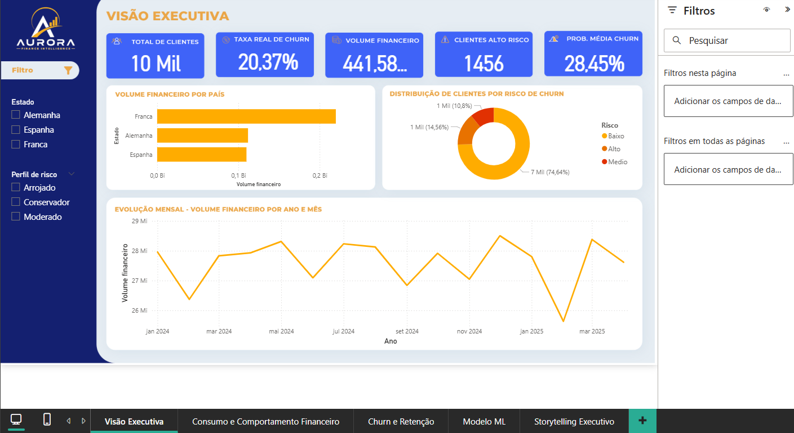 | 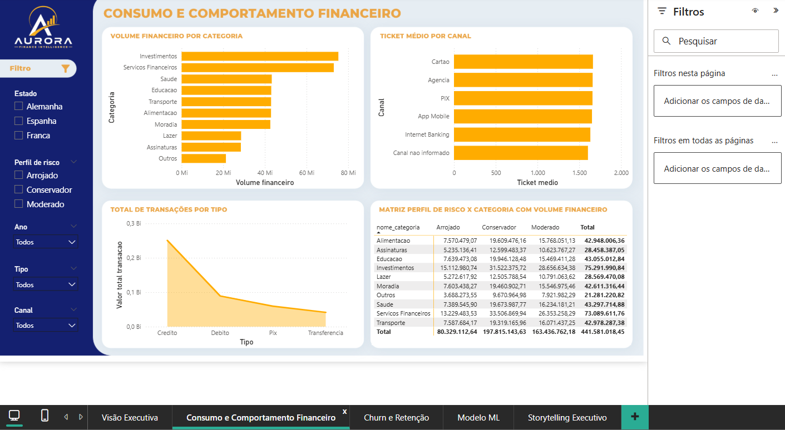 |

| Churn E Retenção | Modelo ML |
|---|---|
| 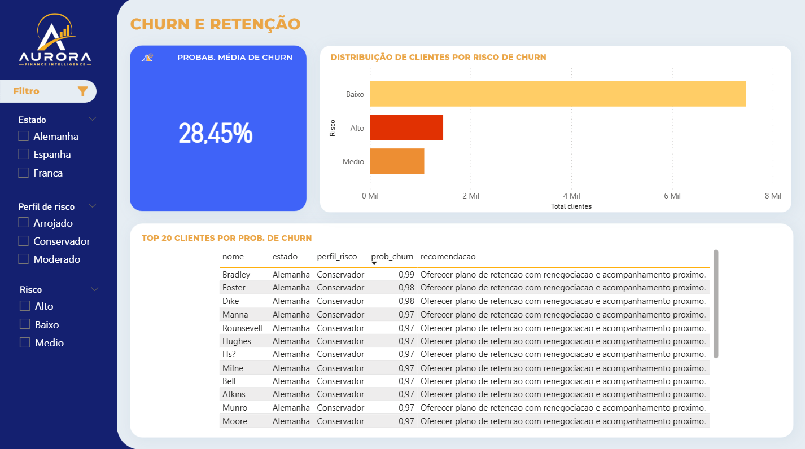 | 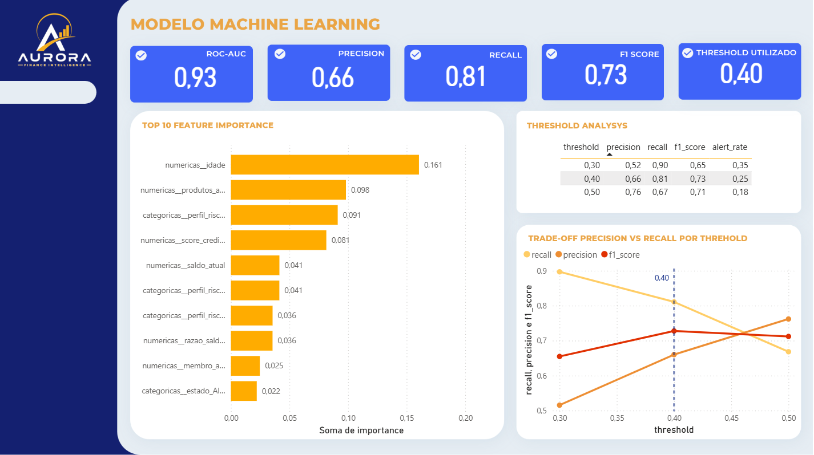 |

| Storytelling Executivo |
|---|
| 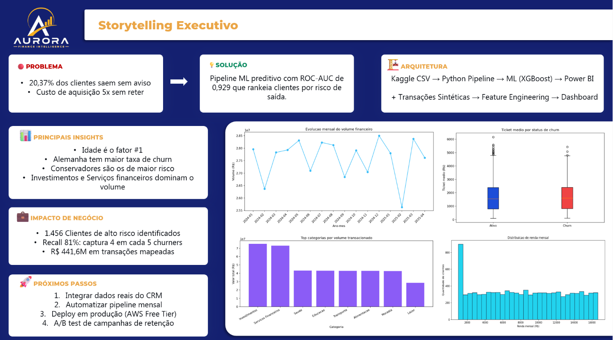 |

## Evidências Técnicas

- `dados/outputs/metricas_modelo.json`
- `dados/outputs/predicoes_churn.csv`
- `dados/outputs/feature_importance.csv`
- `dados/outputs/threshold_analysis.csv`
- `dados/outputs/classification_report.json`
- `reports/figuras/`
- `reports/screenshots/app/`
- `sql/`
- `notebooks/`
- `app/public/data/`
- `modelo/model.pkl`
- `powerbi/screenshots/`
- `powerbi/aurora_finance_intelligence.pbix`

## Evolução Futura

- Calibrar threshold com meta operacional real.
- Comparar outros modelos sem overengineering.
- Adicionar monitoramento de drift.
- Evoluir upload XLSX no navegador caso o peso da dependência seja aceitável.
- Conectar API apenas se houver necessidade real.
- Publicar a versão estática em S3 Static Website ou AWS Amplify com controle de custo.

## Documentação Complementar

- [docs/dataset_publico.md](docs/dataset_publico.md)
- [docs/dicionario_dados.md](docs/dicionario_dados.md)
- [docs/arquitetura_solucao.md](docs/arquitetura_solucao.md)
- [docs/storytelling_powerbi.md](docs/storytelling_powerbi.md)
- [docs/perguntas_banca.md](docs/perguntas_banca.md)
- [docs/deploy_aws_free.md](docs/deploy_aws_free.md)
- [docs/auditoria_final.md](docs/auditoria_final.md)
